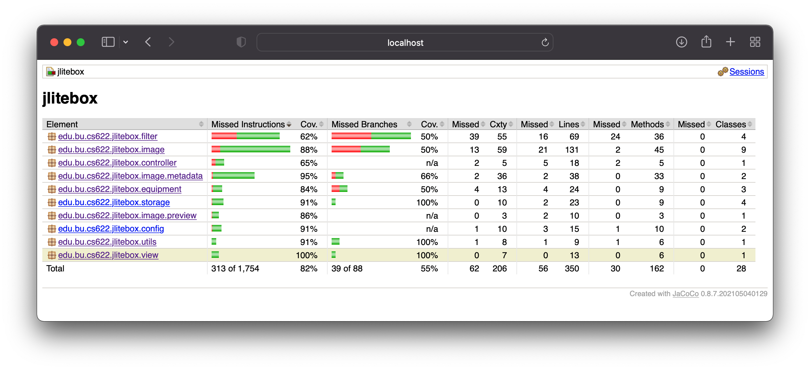

# bu-ms-s5-05
CS622 HW5

Iteration 5 of the JLiteBox software.

  [](https://github.com/dalegaspi/bu-ms-s5-05/actions/workflows/maven.yml)

## Contents

* [Overview](#overview)
* [Application Stack](#application-stack)
* [Build](#build)
  - [Tests and Test Coverage](#tests-and-test-coverage)
* [Running JLiteBox](#running-jlitebox)
  - [Running with a GUI](#running-with-a-gui)
  - [Importing from a Directory](#importing-from-a-directory-gui-bypass)
  - [Importing from a URL List File](#importing-from-a-url-list-file-gui-bypass)
* [Configuration](#configuration)
* [Application Code + Design](#application-code--design)
  - [Code Packages](#code-packages)
  - [Entry Point](#entry-point)
  - [Design Overview](#design-overview)
  - [Dependency Injection](#dependency-injection)
  - [Factory Pattern](#factory-pattern)
  - [Using Functional Data Structures with Vavr](#using-functional-data-structures-with-vavr)
  - [Exception Handling](#exception-handling)
  - [Object Persistence + Serialization](#object-persistence--serialization)
      - [SQLite3 Persistence](#sqlite3-persistence)
      - [JSON as Datastore Format](#json-as-datastore-format)
  - [GUI and JavaFx](#gui-and-javafx)
  - [Multi-Threading](#multi-threading)

## Overview

JLiteBox is a JavaFx application that catalogs RAW and JPG images and allows the user to display them in a GUI.  It is essentially a clone of the popular [Adobe Lightroom](https://lightroom.adobe.com) or [PhotoMechanic by Camera Bits](https://store.camerabits.com).

## Application Stack

- [JavaFX](https://openjfx.io)
- [Maven](https://maven.apache.org)
- [Google Guice](https://github.com/google/guice)
- [SQLite](https://www.sqlite.org/index.html)
- [Metadata Extractor](https://github.com/drewnoakes/metadata-extractor/wiki/Getting-Started-(Java))
- [vavr.io](https://www.vavr.io)
- [LibRawFx](https://github.com/lanthale/LibRawFX)
- [Typesafe Config](https://github.com/lightbend/config)
- [JUnit](https://junit.org/junit5/docs/current/user-guide/)
- [SLF4J](https://www.slf4j.org)
- [Logback](https://logback.qos.ch)
- [JaCoCo](https://www.eclemma.org/jacoco/)
- [Jackson](https://github.com/FasterXML/jackson)

## Build
The Maven configuration creates a jar file `jlitebox-1.0-SNAPSHOT-jar-with-dependencies.jar` in the `/target` directory.  Note that there is also another smaller `jlitebox-1.0-SNAPSHOT.jar` that's available but that will not have all the app dependencies and will require you to set up the classpath for the app's dependencies.

```shell
$ mvn package
```

### Tests and Test Coverage

Running `mvn test` should run all the unit tests and create a Test Coverage report in `target/site/jacoco`.  You should be able to see the results of the test and the test coverage with JaCoCo's comprehensive report.



## Running JLiteBox

The project runs on language level 11 but requires Java 17 to run to be able to leverage the latest features of JavaFx.

### Running with a GUI

```shell
$ java --enable-native-access ALL-UNNAMED \
	--add-modules jdk.incubator.foreign \
	-jar jlitebox-1.0-SNAPSHOT-jar-with-dependencies.jar
```

The standard way of running the app with all its features.  For this iteration, it now displays all images in the catalog:

<p align="center">
  
</p>

### Importing from a Directory (GUI Bypass)

```shell
$ java --enable-native-access ALL-UNNAMED \
	--add-modules jdk.incubator.foreign \
	-jar jlitebox-1.0-SNAPSHOT-jar-with-dependencies.jar -d {import-dir}
```

Imports the images in specified directory `import-dir` to store them in the configured catalog and logs the activity/status on the standard output (usually the screen).

There is a sample folder that's available under `sample/images` so you can test the app with:

```shell
$ cd target/
$ java --enable-native-access ALL-UNNAMED \
	--add-modules jdk.incubator.foreign \
	-jar jlitebox-1.0-SNAPSHOT-jar-with-dependencies.jar -d ../sample/images/
```

### Importing from a URL List File (GUI Bypass)

The file is a simple text file with a list of URLs where the import can download from; it is assumed that the images hosted in the URL does not require any authentication to be able to create a copy of the said image locally.

There is a sample file that's available under `sample/import.txt` so you can test the app with:

```shell
$ cd target/
$ java --enable-native-access ALL-UNNAMED \
	--add-modules jdk.incubator.foreign \
	-jar jlitebox-1.0-SNAPSHOT-jar-with-dependencies.jar -i ../sample/import.txt
```
## Configuration

The application is configured using the HOCON format which can be found in `resources/application.conf` file.  Below are the configuration parameters and what they mean:

| Parameter               | Type         | Default                                | Remarks                                                                                                    |
|-------------------------|--------------|----------------------------------------|------------------------------------------------------------------------------------------------------------|
| `import.overwrite`      | boolean      | `true`                                 | To denote if file import overwrites by default                                                             |
| `import.temp-dir`       | string       | `System.getProperty("java.io.tmpdir")` | The temp directory for downloading and images being processed                                              |
| `storage.root-dir`      | string       | `~/tmp`                                | The root directory of the catalog where files are stored during import and read from when rendering on GUI |
| `metadata.db-url`       | string       | `jdbc:sqlite:db/jlitebox.sqlite`       | The SQLite3 database where image metadata is stored                                                        |
| `images.supported-exts` | string array | `[ JPG, DNG, NEF ]`                    | File extensions of supported files                                                                         |
| `preview.width`         | int          | 640                                    | Pixel width for previews for RAW files                                                                     |
| `preview.height`        | int          | 480                                    | Pixel height for previews for RAW files                                                                    |

### Logging

Logging is done using LogBack (in conjunction with SLF4J) and follows the same standards for logging configuration located in `resources/logback.xml`.  Right now, the logging is on console only in `INFO` level.

## Application Code + Design

### Code Packages

The code are sub-divided into packages according to their logical grouping:

| Name             | Remarks                                                                                                                       |
|------------------|-------------------------------------------------------------------------------------------------------------------------------|
| `config`         | Application and catalog configuration                                                                                         |
| `controller`     | Application controllers (MVC)                                                                                                 |
| `equipment`      | Image equipment classes (e.g., camera, lens)                                                                                  |
| `exceptions`     | Exception custom classes                                                                                                      |
| `filter`         | Filtering of Images for GUI display                                                                                           |
| `image`          | The basic models for representing the images, mainly the `Image` class and sub-classes, along with the catalog and downloader |
| `image.metadata` | Handling of image metadata                                                                                                    |
| `image.preview`  | Handling of image previews                                                                                                    |
| `storage`        | Storage of file and metadata database (SQLite3 JDBC)                                                                          |
| `utils`          | General/common utility classes and/or static functions that is shared across the application                                  |
| `view`           | Application views (MVC)                                                                                                       |

### Entry Point

The `edu.bu.cs622.jlitebox.App` is the main class, but the `edu.bu.cs622.jlitebox.AppFx` is where the heart of the application starts.  This is done because of the strict Java 9 modularity that JavaFx follows and since JavaFx is not distributed with the JDK since Java 11, this pattern is adopted to get around it. More explanation can be read [here](https://edencoding.com/runtime-components-error/).

### Design Overview

This is a relatively basic implementation of [Model-View-Controller design pattern](https://en.wikipedia.org/wiki/Model–view–controller).  The controllers are in the `edu.bu.cs622.jlitebox.controller` package and the views are in `edu.bu.cs622.jlitebox.view` package.  As noted in the previous section, the application can be run in GUI or console mode depending on the parameters, and the console mode not only has the ability to emit messages (leveraging the logging framework) but also accept inputs from the user via the keyboard.  The GUI based view/controller are within the JavaFx framework which has its own [MVC implementation shown in this article](https://docs.oracle.com/javafx/2/best_practices/jfxpub-best_practices.htm) and the application abides by the best practices as dicated by the article.

### Dependency Injection
We are leveraging [Dependency Injection](https://en.wikipedia.org/wiki/Dependency_injection) technique through [Google Guice](https://github.com/google/guice).  You can see this used throughout the app and the modules are defined in `JLiteBoxModule`:

```java
public class JLiteBoxModule extends AbstractModule {
	@Override
	protected void configure() {
		bind(ImageCatalogConfiguration.class).to(BasicImageCatalogConfiguration.class);
		bind(ImageImportController.class).to(ConsoleFileImportController.class);
		bind(ImageImporterView.class).to(ImageImporterConsoleView.class);
		bind(ImageCatalog.class).to(BasicImageCatalog.class);
		bind(ImageMetadataStorage.class).to(DatabaseImageMetadataStorage.class);
		bind(ImageStorage.class).to(FileImageStorage.class);
		bind(ImageMetadataStorage.class).to(DatabaseImageMetadataStorage.class);
		bind(UserInputSource.class).to(UserKeyboardInputSource.class);
		bind(ImageDownloader.class).to(BasicImageDownloader.class);
		bind(ImageMetadataExtractor.class).to(LibRawMetadataExtractor.class);
		bind(ImagePreviewGenerator.class).to(LibRawImagePreviewGenerator.class);
	}
}
```

And these are used accordingly with the injector like shown in the code below:

```java
// create the Guice injector
var injector = Guice.createInjector(new JLiteBoxModule());

// create the class you want using dependency injection
var previewGenerator = injector.getInstance(ImagePreviewGenerator.class);

// profit!
var preview = previewGenerator.generatePreview((RawImage) img);
```

### Factory Pattern

In addition, where are also using [Factory pattern](https://en.wikipedia.org/wiki/Factory_(object-oriented_programming)) when the dependency-injection using Guice is not necessary or deemed overkill.  One example of this is the `ImageFactory` used to create instances of `Image` by specifying a file location:

```java
public final class ImageFactory {
	public static Image fromFile(String path) {
		return ImageUtils.isJpegImage(path) ? new JpegImage(path) : new RawImage(path);
	}
}
```

And this is used like this:

```java
// creates a RawImage instance
var image = ImageFactory.fromFile("./hello.dng");
```

### Using Functional Data Structures with Vavr

The advent of Java 8's "functions as first-class citizens" allows us to write with Functional Programming principles in mind, and this has been enhanced using [Vavr](https://docs.vavr.io/).  The features of the library are used sparingly so as not to deviate/clash with the OOP constructs being taught in this class, but we do apply them where it would make the code more concise and robust, and thus easier to reason about.  Consider this simple example:

```java
shutterSpeed = Try.of(() -> Float.parseFloat(s)).getOrElse((float) 0));
```

The use of [monadic construct `Try<T>`](https://docs.vavr.io/#_try) allows us to write a shorter, more concise code that achieves the same effect: here instead of having a try/catch block to assign `0` to `shutterSpeed` we are using `Try::of` instead which "maps" the result if successful and "maps left" to assign 0 if fails.

### Exception Handling

The application leverages the use of custom exceptions for having the option of "recovering" from errors that are not critical like out-of-memory errors. The base class `JLiteBoxException` has a `requiresInteraction()` method to denote if an error is recoverable or not.

```java
public class JLiteBoxException extends Exception {
	boolean interact = false;

	public boolean requiresInteraction() {
		return this.interact;
	}
}
```

And with that you have further convenience subclasses `NonRecoverableException` and `RecoverableException` which sets the `interact` false automatically in the constructors and all other exceptions can either derive directly from `JLiteBoxException` or either of the intermediate mentioned subclasses.  The Controller and/or View can leverage the `JLiteBoxException::requiresInteraction` method to see if a failure in an operation can be recovered and ask the user to continue or not.

### Object Persistence + Serialization

We are using the JSON format to serialize/deserialize objects to make it more portable and avoid the [general issues that's tied to the default binary serialization](https://access.redhat.com/blogs/766093/posts/1976093) to persist objects for long-term storage.  We are using  [Jackson](https://github.com/FasterXML/jackson) for JSON serialization/deserialization.

#### SQLite3 Persistence

We are using SQLite3 to persist our image metadata and JPEG preview blobs.  Below is the fields for the database.  The artifacts are in the `/db` sub-folder including the schema

| Name              | Type    | Nullable? | Remarks                                                               |
|-------------------|---------|-----------|-----------------------------------------------------------------------|
| name              | text    | no        | PK, Name derived from src file name                                   |
| image_type        | text    | yes       | JPG for JPEG (default), RAW based on the src file name extension      |
| src_path          | text    | no        | The location in the file storage                                      |
| camera_brand      | text    | yes       | Camera brand (extracted from EXIF metadata)                           |
| camera_model      | text    | yes       | camera model (extracted from EXIF metadata)                           |
| camera_autofocus  | numeric | yes       | is camera auto-focus? (inferred from brand/model)                     |
| lens_brand        | text    | yes       | lens brand (extracted from EXIF metadata)                             |
| lens_focal_length | real    | yes       | Lens focal length (extracted from EXIF metadata)                      |
| shutter_speed     | real    | yes       | Image shutter speed (extracted from EXIF metadata)                    |
| capture_date      | integer | yes       | Image capture date epoch format (extracted from EXIF metadata)        |
| iso               | integer | yes       | Image ISO (extracted from EXIF metadata)                              |
| raw_metadata      | text    | yes       | The raw image metadata in JSON format from `ImageMetadata` java class |
| image_preview     | blob    | yes       | JPEG preview binary blob                                              |

### JSON as Datastore Format
For this application, the use case for object persistence is for saving/reading image metadata to/from a SQLite3 database (in `raw_metadata` field) as reading the metadata from the RAW file itself is very expensive and poses a lot overhead (like having to use JavaFx classes which are relatively heavyweight).  It is much more efficient to read this from a database and then deserialize.  This is the strategy that we employ here: the metadata is serialized into JSON like this before written into database.  Here is an example of the `ImageMetadata` instance when serialized to JSON (prior to persisting to database):

```json5
{
	"rawData": {
		"CameraModel": "Z 6",
		"MaxAp @MaxFocal": "f/2.8",
		"ExposureProgram": "-1",
		"MedteringMode": "-1",
		"Focal length": "105.0 mm",
		"Shutter": "200.0",
		"MaxFocal": "105.0 mm",

		// ... other fields

		"XMP": "<?xpacket> .... <?xpacket end=\"w\"?>",
		"Lens": "NIKKOR Z MC 105mm f/2.8 VR S",
		"FocusMode": "-1",
		"MinFocal": "105.0 mm"
	},
	"aperture": 2.8,
	"shutterSpeed": 105.0,
	"captureDate": 1641764652000,
	"iso": 100
}
```

And with Jackson we leverage the library's annotation so that the library can instantiate the proper subclass if using abstract and/or interfaces.  In our case, `ImageMetadata` has `Camera` and `Lens` fields that are instances of the abstract class `ImagingEquipment` so we need to provide hints on what subclass to use to instantiate, and these what the annotations are used for.  So we have these annotations in `ImagingEquipment` declaration:

```java
@JsonIgnoreProperties(ignoreUnknown = true)
@JsonTypeInfo(use = JsonTypeInfo.Id.NAME, include = JsonTypeInfo.As.PROPERTY)
@JsonSubTypes({ @JsonSubTypes.Type(value = Camera.class, name = "Camera"),
				@JsonSubTypes.Type(value = Lens.class, name = "Lens") })
public abstract class ImagingEquipment {
	// ...
}
```

### GUI and JavaFx

We are fully leveraging JavaFx to generate the GUI and one of the core features implemented here is the creation of JPEG preview for RAW files that would have not been possible without the LibRawFx library.  There are limitations to this library, however as it can only support cameras like Nikon (newer cameras only), Canon and Fuji. 

We are also using JavaFXML for UI markup language to be able to see what the GUI will look like while building it.


### Multi-Threading

The application centers on 2 use cases for the use of threads:

- Make importing of images faster by using multiple threads of execution.  Importing has 2 expensive operations: generating a preview and reading the EXIF metadata but both of these are I/O heavy and allows better scheduling.  This also allows us to use a better thread pool other than ForkJoinPool which is actually not optimized for heavy I/O threads.
- Make the GUI responsive.  JavaFx GUI update _is_ single-threaded, and what makes it even more complicated is that it allows update of GUI in its _own_ thread.  Fortunately, it doesn't prevent us from using threads altogether but the thread would not be able to update GUI from its own execution path; to make this possible we are using the convenience function `Platform::runLater`.  In our own specific use, when you import from the GUI, the import is done in the background as soon as you hit OK so the GUI remains responsive while the GUI's status bar is being updated with the status of the import operation.  Consider the code snippet from `MainController` class:

As for the implementation, we mainly leveraged the newer `CompletableFuture<T>` construct that allows the use of parallelism and asynchronous operations that are relatively easy to manage and reason about.  We are using thread-safe collection and object types and use immutability whenever possible to totally avoid the use of `synchronized` keyword and explicit locking of resources that are potentially not thread-safe.

```java
private void updateStatusBarText(String text) {
    Platform.runLater(() -> {
        logger.info("Refreshing view...");
        initializeImageCollectionView();
        statusBar.setText(text);
    });
}

// updateStatusBarText is used here
protected void handleFileImportAction(ActionEvent event) {
    if (selectedDirectory != null) {
        // ...
        CompletableFuture.runAsync(() -> Try.of(() -> catalog.addImagesFromDirectory(
                        selectedDirectory.getAbsolutePath(),
                        ImageFactory.withDefaultImportOptions(),
                        (currentImage, currentIndex, all) -> {
                            logger.info("Image {} of {} imported.", currentIndex, all);
                            updateStatusBarText(String.format("Image %d of %d imported.", currentIndex, all));
                            return null;
                        }))).thenRun(() -> Platform.runLater(() -> {
                            // once everything is finished, refresh the main view
                            logger.info("Refreshing view...");
                            initializeImageCollectionView();
                            statusBar.setText(statusBarDefaultText);
                        }));
    }
}

```